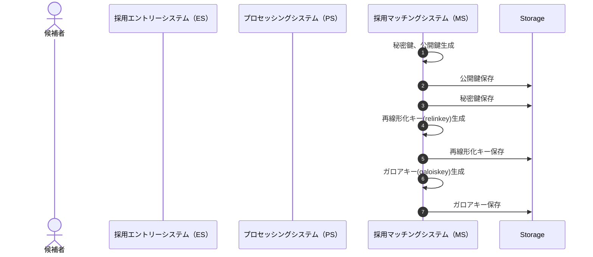
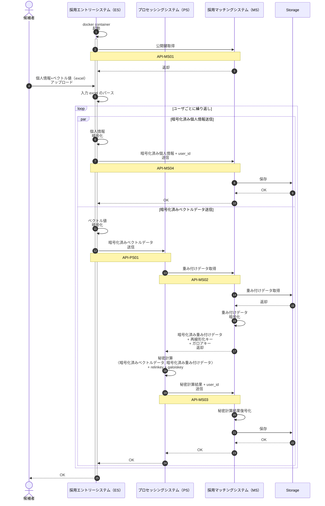

# シンプルなアーキテクチャ

## システム間連携に必要なAPI

名前は便宜上つけてます。連番ですが順不同。
登場箇所は下記のシーケンス図を参照。

#### API-MS01

* MS 上で稼働
* ESから呼び出される
* 公開鍵を返却する

#### API-MS02

* MS 上で稼働
* PS から呼び出される
* 重み付けデータを暗号化して、再線形化キー、ガロアキーと共に返却する

#### API-MS03

* MS 上で稼働
* PSから呼び出される
* 秘密計算結果を受け取って、復号化の後、保存する

#### API-MS04

* MS 上で稼働
* ES から呼び出される
* 暗号化された個人情報を受け取って保存する

#### API-PS01

* PS 上で稼働
* ES から呼び出される
* 暗号化されたベクトルを受け取る
* 秘密鍵計算を実行する
* 計算結果をMSに送信する

## シーケンス図

### fig.1 システムの鍵作成

システムで一意。

### fig2. データ入力から秘密計算結果保存までの流れ

