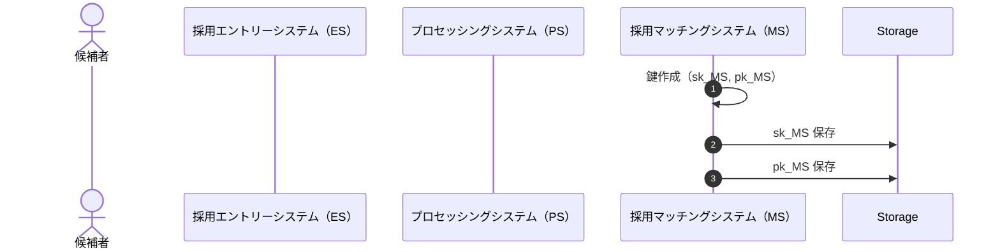
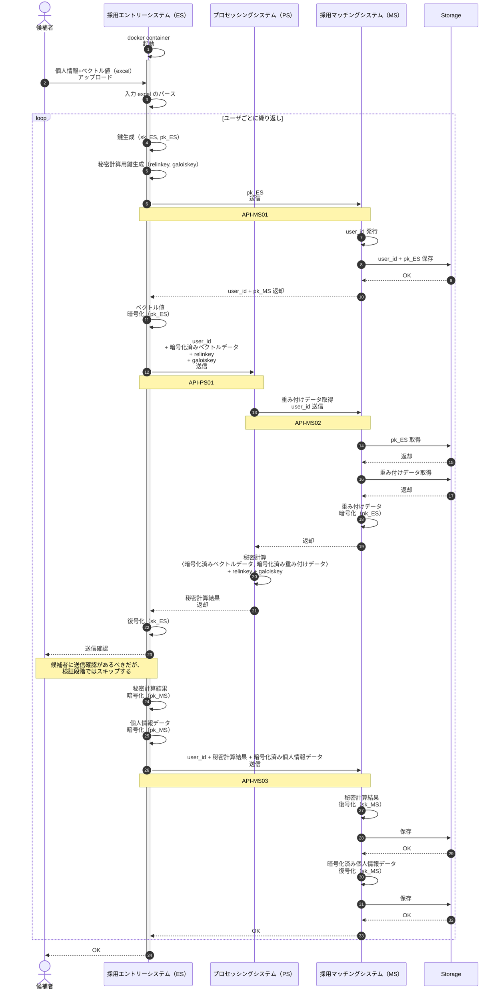

# 個人主権重視型のアーキテクチャ

## システム間連携に必要なAPI

名前は便宜上つけてます。連番ですが順不同。
登場箇所は下記のシーケンス図を参照。

#### API-MS01

* MS 上で稼働
* ESから呼び出される
* ユーザの公開鍵を受け取る
* user_id を発行する
* user_id + システムの公開鍵を返却する

#### API-MS02

* MS 上で稼働
* PS から呼び出される
* 重み付けデータを暗号化して返却する

#### API-MS03

* MS 上で稼働
* PSから呼び出される
* 暗号化済み秘密計算、暗号化済み個人情報を受け取る
* 上記を復号化の後、保存する

#### API-PS01

* PS 上で稼働
* ES から呼び出される
* 暗号化されたベクトル、ユーザの秘密鍵から生成された再線形化キー、ガロアキーを受け取る
* 秘密鍵計算を実行する
* 計算結果をMSに送信する

## シーケンス図

ユーザの手元で作成される 【秘密鍵, 公開鍵】を【sk_ES, pk_ES】 と記載する
システムで一意の 【秘密鍵, 公開鍵】を【sk_MS, pk_MS】 と記載する

### fig.1 システムの鍵作成

### fig2. データ入力から秘密計算結果保存までの流れ

