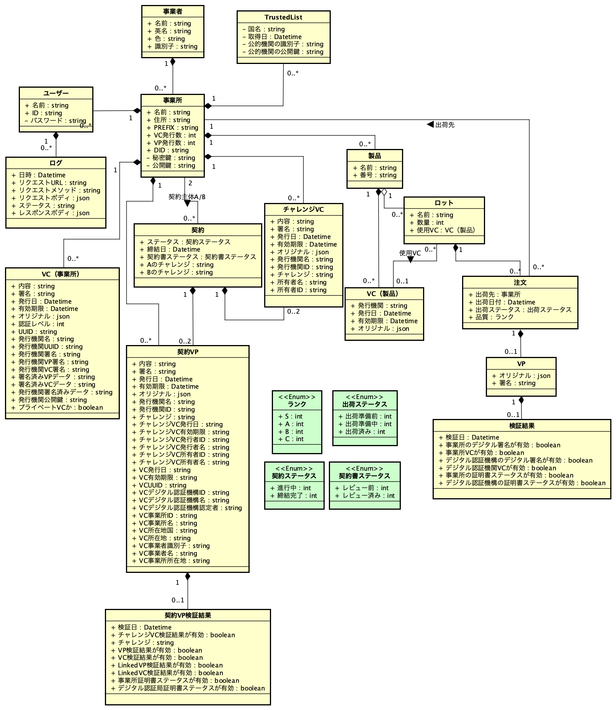

このリポジトリは Trusted Webの事業所デモ用 とする。

## プログラム構成

### ディレクトリ構成

  提供するプログラムで動作確認する際に関係する主要なディレクトリは以下の通り。
```
  ディレクトリ名  説明
  /app           データの処理ロジック格納ディレクトリ
    /api         バックエンド格納ディレクトリ
    /{etc}       フロントエンドpage格納ディレクトリ
  /components    画面の表示ロジック（コンポーネント）格納ディレクトリ
  /prisma        DB関連ファイル格納ディレクトリ
  /public        イメージファイル格納ディレクトリ
  /types         Enum型格納ディレクトリ
```

### コンテナ構成

  プログラムはDockerを前提に提供している。以下、動作確認する際に関係する主要なコンテナは以下の通り。
  詳細については、ルートディレクトリ下のdocker-compose.ymlファイルおよびDockerfileにて確認可能。
```
  コンテナ名    説明
  app          本アプリ http://localhost:3006で稼働
  postgres     本アプリで利用するデータベース 5432番ポートで稼働
```

## 環境構築手順

### 前提条件

- 本プログラムはDocker上で動作するイメージ形式である。
- gitをインストールしておく。
- 動作させるにあたってメモリは最低1GB以上割り当てが必要。
- ネットワークに接続している状態であること。
- 各事業のDIDとKeyペアーはデータベースに保存済み。
- 別途、デジタル認証機構を構築して起動済み。


### 手順

#### １．github より対象一式をダウンロード
 `git clone https://github.com/brp-project/brp-biz-front.git`

#### ２．brp-biz-frontフォルダに移動
git clone したフォルダにbrp-biz-frontフォルダが出来るのでそこへ移動。

#### ３．.envファイルの修正
デジタル認証機構にアクセスするため、BRP_HOST_URLにご利用環境で準備したデジタル認証機構のURLを追加

追加例：`BRP_HOST_URL=localhost`


#### ４．Dockerの起動

   ＜Docker起動（初回）＞
  
  `$ docker compose build`

  `$ docker compose run --rm app yarn install`

  `$ docker compose run --rm app npx prisma generate`

  `$ docker compose run --rm app npx prisma migrate dev`

  `$ docker compose run --rm app npx prisma db seed`

  `$ docker compose up`

  ＜Docker起動（2回目以降）＞
  
  `$ docker compose up`

  ただし、docker compose upは、-dオプションをつけてバックグラウンドで起動することも可能。

  ＜WEBサービスの起動完了ログ＞
 ```
▲ Next.js 14.0.3
 - Local:        http://localhost:3000
 - Environments: .env

 ✓ Ready in 41.3s
 ```


#### ５．Dockerの停止

  `$ docker compose down`

  - オプション-dをつけないで実行した場合はCtrl+c実行後、docker compose downを実行すること。  

## 動作確認手順

### １．Docker
  以下のコマンドでログの参照が可能、Errorという文字列が出ていなければ正常動作中。

  `$ docker logs <コンテナ名>`

### ２．web
  Webブラウザで以下のURLにアクセスしサンプル画面のメニューが表示される場合は正常動作中。

  `http://localhost:3006`


### ３．データベースのリセット
  本アプリにはデータベースのリセット機能が実装されているが、以下のコマンドでもリセットが可能。
  以下のコマンドを実行すると、すでに登録したすべてのデータを削除した後、シードデータを注入する。
  リセットにより注入されるユーザーデータは/prisma/seed.tsか、または下記ログインアカウントの項を参照。

  `$ docker compose exec app npx prisma db push --force-reset`

  `$ docker compose run --rm app npx prisma migrate dev`


#### ログインアカウント
  
事業者名​ | 事業所名​ | ログインID​ | パスワード
-- | -- | -- | --
メーカーA | 第1営業部​ | `alice@a.com`​ | Passw0rd
メーカーA | 第2営業部​ | `bob​@a.com` | Passw0rd
部品メーカーB | 倉庫X​ | `carol​@a.com` | Passw0rd
部品メーカーB​ | 工場Y​ | `dave​@a.com` | Passw0rd
​セミコンJ | 工場B​ | `eve​@a.com` | Passw0rd
​セミコンJ | 品質保証部​ | `frank​@a.com` | Passw0rd
​セミコンT | 工場Z​ | `zebra​@a.com` | Passw0rd
事業者P​ | 工場P​ | `peter@a.com` | Passw0rd
​事業者R | 事業所R​ | `romeo@a.com` | Passw0rd
​K Holdings | 事業所甲​ | `kylian@a.com` | Passw0rd
​O Corp. | 事業所乙​ | `oscar@a.com` | Passw0rd

#### デモアプリの説明
  
メニュー名​ | ​操作する事業所名 | デモアプリ説明​ |
-- | -- | -- |
出荷管理 | 倉庫X、工場Y​ | 事業所VCを付けて出荷 |
入荷管理 | 第1営業部、第2営業部​、事業所R​  | 事業所VCを検証（Verify） 入荷時（第1営業部、第2営業部を使用）、「製造場所」を確認（事業所R​を使用）|
証明書(VC)管理 | すべての事業所​ | 事業所VCの発行申請、Public Trust設定（工場Pを使用） |
Trusted List | すべての事業所​ | 公的機関の公開鍵を取得 |
取引先管理 | 事業所甲、事業所乙​ | 契約時、取引相手となる事業所の実在性を確認 |
設定 | すべての事業所​ | 入力したデータの初期化、ユーザ管理 |

※補足：はじめに、証明書(VC)管理メニューから事業所VCの発行申請をして下さい。

## ドメインモデル
