# 全体概念図
（実装しているアーキテクチャーとは異なります）
<!--  -->

# 各コンポーネントごとの主要機能図
（実装しているコンポーネントアーキテクチャーとは異なります）

## 公的機関

## 認証機構

## 失効管理機構

## 事業所サンプル実装

Todo

# 今回実装したコンポーネント構成図

# 今回実装したコンポーネントとGit Repositoryの関係

Todo

# （参考）将来像

