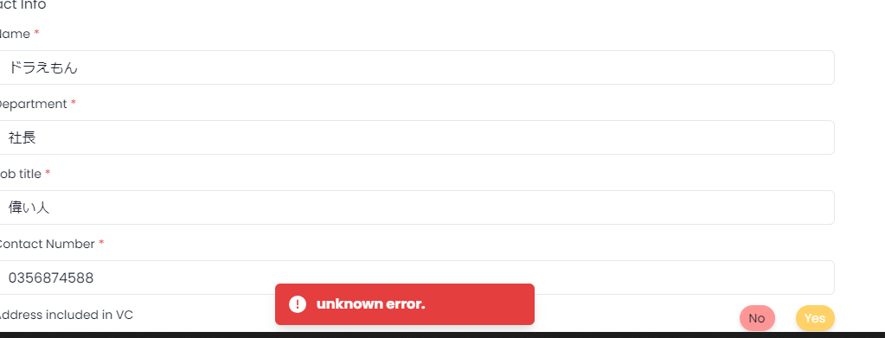
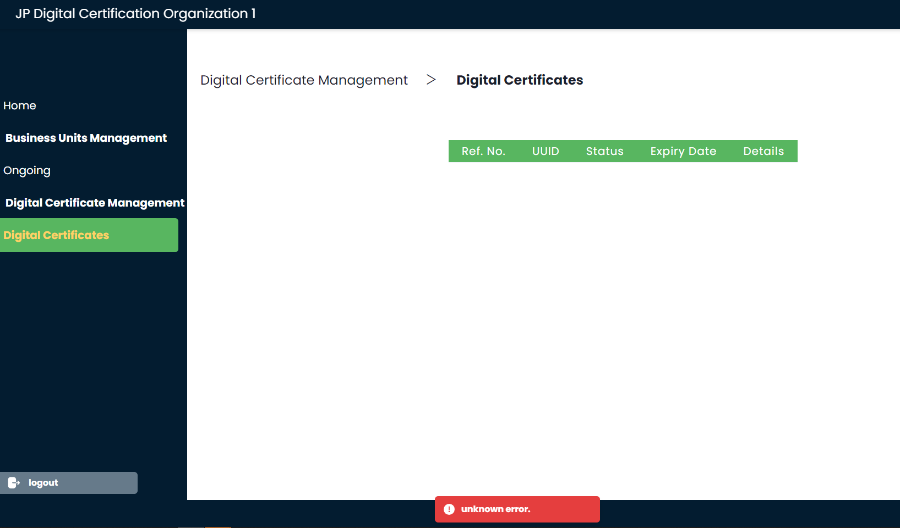
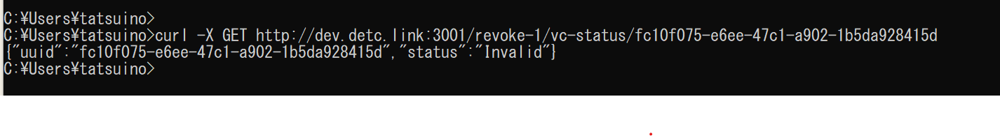

# 可用性テスト

## 可用性テストの背景

本取り組みでは、事業所IDを発行するサービス全体をプライベートブロックチェーン基盤を用いた事業所ID認証基盤ネットワークという形で構築している。  
認証基盤サービスを分散化（ネットワーク化）させる理由の一つに、非機能要件が異なるAPIごとに異なるサーバを立てておくことで、サービス全体のトータルコストを下げられるのではないかという点がある。　　  
（それ以外にもガバナンスやプライバシーの課題に対する回答となるという、分散化に対するより強い理由も存在する）　　  

この可用性テストでは、　
**①高い可用性を求められるAPI（失効管理サービス）**
と
**②それほど高い可用性を必要としないAPI（デジタル認証機構）**
を異なるサーバ（実際はDocker）上で
稼働させた上で、②が停止状態であっても①が正しく動作することを確認している。　　  

なお、異なるサーバ間で情報が同期していることについては、今回用いたプライベートブロックチェーン基盤（Corda）が保証していることから、テスト検証の対象外としている。　　

## 可用性テストのゴール
比較的可用性要求が低いデジタル認証機構がダウンしていたとしても、失効管理機構がサービス継続していること

## 可用性テストのアーキテクチャ

## 可用性テストのやり方
1. デジタル認証機構に関わるCordaコンポーネントシャットダウン
1. デジタル認証機構のサービスが停止していることの確認
    1. 事業所がデジタル認証機構に対して事業所IDを申請し、申請できないことを確認   

    
    1. デジタル認証機構アプリにおいて、証明書一覧ページが動作しないことを確認

    
1. 事業所IDの有効性検証を行い、失効管理機構が正しく動作していることを確認(curlベース)

    

## 可用性テストの結果まとめ
[テスト結果資料](../pdf/結合テスト仕様書兼結果報告書.pdf)
