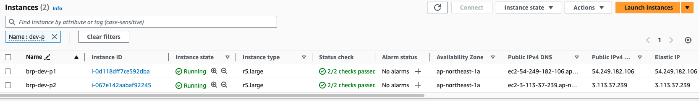
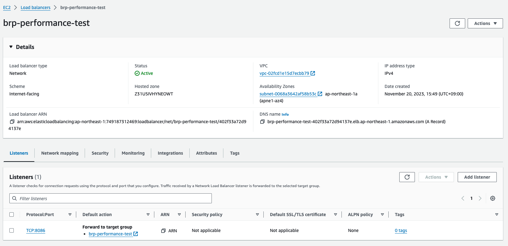
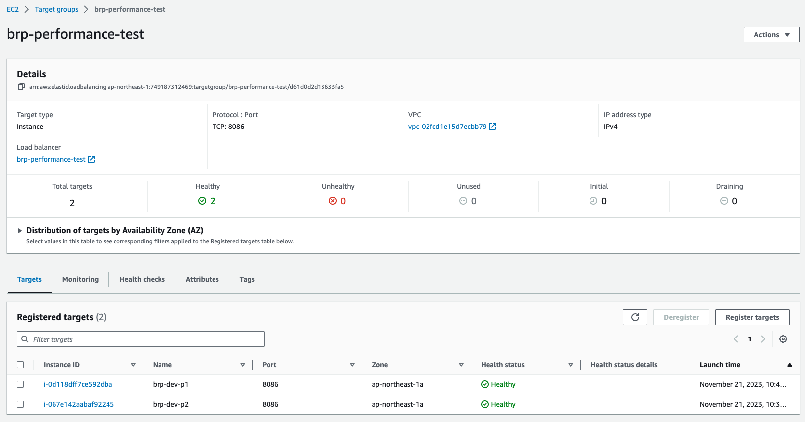

# 負荷テスト

## 負荷テストの背景

本取り組みでは、事業所IDを発行するサービス全体をプライベートブロックチェーン基盤を用いた事業所ID認証基盤ネットワークという形で構築している。    
認証基盤サービスを分散化（ネットワーク化）させる理由の一つに、非機能要件が異なるAPIごとに異なるサーバを立てておくことで、サービス全体のトータルコストを下げられるのではないかという点がある。  　　  
（それ以外にもガバナンスやプライバシーの課題に対する回答となるという、分散化に対するより強い理由も存在する）  

この可用性テストでは、最も高い負荷がかかる可能性のある失効管理APIについて、セキュアな形で冗長化することで、そのパフォーマンスが向上すかどうかを検証している。  
失効管理APIについては、今後のビジネス展開によっては複数の国／地域で共用する場合や、逆に分散化し国／地域ごとに立ち上げる可能性もあることから、冗長化にあたっては裏側でプライベートブロックチェーン基盤を用いた分散化した上での冗長化を行なっている。  　　  

なお、分散したサーバ間で情報が同期していることについては、今回用いたプライベートブロックチェーン基盤（Corda）が保証していることから、テスト検証の対象外としている。　　

## 負荷テストのゴール
失効管理サービスを２つ立てた場合に、一つであった場合よりも同時処理能力が高くなっていることを確認すること。

## 負荷テストのアーキテクチャ
### テストパターン

### テスト時のアーキテクチャ

### テストサーバスペック

## 負荷テスト結果

1サーバ→2サーバへ拡張した場合の能力拡張率（2サーバ時のRPS／1サーバ時のRPS）  
- 過負荷時：1.64倍
- 高負荷時：1.35倍
- 低負荷時：1.04倍

## 負荷テストパターン及び結果
| パターン | 失効サービス稼働数 | 負荷スレッド数 | RPS(req/s) | 99% RST(ms) | 結果詳細 |
| :----: | :----: | :----: | :----: | :----: | :----: |
| 低負荷状態 | 1つ | 10 | 84.77 | 260 | [テストパターン1](テストパターン1.md) |
| 低負荷状態 | 2つ | 10 | 88.56 | 318 |[テストパターン4](テストパターン4.md) |
| 高負荷状態 | 1つ | 50 | 112.49 | 692 | [テストパターン3](テストパターン3.md) |
| 高負荷状態 | 2つ | 50 | 151.94 | 860 | [テストパターン5](テストパターン5.md) |
| 過負荷状態 | 1つ | 100 | 115.55 | 1060 | [テストパターン2](テストパターン2.md) |
| 過負荷状態 | 2つ | 100 | 189.25 | 1347 | [テストパターン6](テストパターン6.md) |

## （参考）テスト中の失効管理サービスの稼働状況

### サービス稼働数１つ

### サービス稼働数２つ

